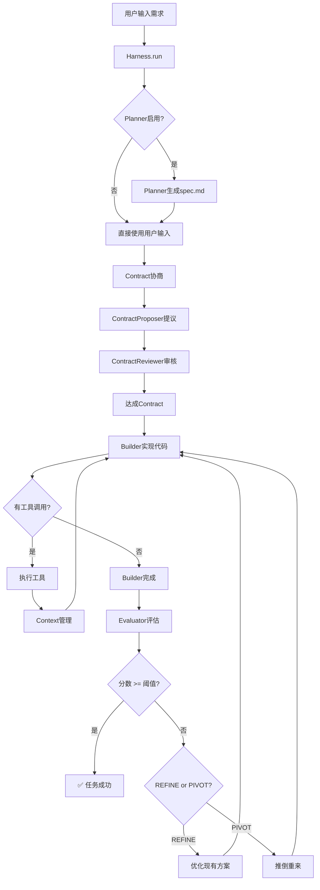
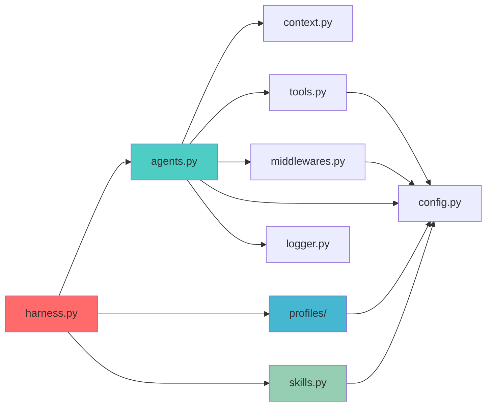

# Harness Engineering - 系统架构文档 🏗️

> **本文档详细描述了 Harness 多 Agent 自主开发框架的系统架构、组件交互和设计模式**

---

## 📋 目录

- [1. 架构概览](#1-架构概览)
- [2. 核心组件详解](#2-核心组件详解)
- [3. 数据流与执行流程](#3-数据流与执行流程)
- [4. 设计模式与架构决策](#4-设计模式与架构决策)
- [5. 扩展指南](#5-扩展指南)
- [6. 性能与优化](#6-性能与优化)

---

## 1. 架构概览

### 1.1 整体架构图

```
┌─────────────────────────────────────────────────────────────────┐
│                        Harness Orchestrator                      │
│                     (harness.py - 主编排器)                       │
└────────────┬────────────────────────────────────────────────────┘
             │
             ├── Plan → Contract → Build → Evaluate 循环控制
             │
    ┌────────▼────────┐
    │   Profile Layer  │  ← 场景配置（app-builder, terminal, etc.）
    └────────┬────────┘
             │
    ┌────────▼────────────────────────────────────────┐
    │              Agent Runtime Layer                 │
    │  ┌──────────┐ ┌────────┐ ┌──────────┐          │
    │  │ Planner  │ │Builder │ │Evaluator │ ...      │
    │  └──────────┘ └────────┘ └──────────┘          │
    └────────┬────────────────────────────────────────┘
             │
    ┌────────▼────────────────────────────────────────┐
    │         Context Management Layer                 │
    │  • Token Counting  • Anxiety Detection           │
    │  • Compaction      • Hard Reset                  │
    └────────┬────────────────────────────────────────┘
             │
    ┌────────▼────────────────────────────────────────┐
    │            Tool Execution Layer                  │
    │  • File I/O  • Shell  • Browser  • Git          │
    └────────┬────────────────────────────────────────┘
             │
    ┌────────▼────────┐
    │  Skill Registry  │  ← 37+ 专业技能（按需加载）
    └────────┬────────┘
             │
    ┌────────▼────────┐
    │   LLM Backend    │  ← OpenAI / OpenRouter / Ollama
    └─────────────────┘
```

### 1.2 技术栈

| 层级 | 技术选型 | 说明 |
|------|----------|------|
| **语言** | Python 3.10+ | 纯Python实现，无编译步骤 |
| **LLM SDK** | openai>=1.0.0 | OpenAI兼容API客户端 |
| **Token计数** | tiktoken>=0.5.0 | 精确Token统计（可选） |
| **浏览器自动化** | playwright>=1.40.0 | Evaluator端到端测试 |
| **配置管理** | python-dotenv | 环境变量加载 |
| **日志系统** | logging | Python标准库 |

### 1.3 核心设计原则

1. **零SDK依赖**: 不依赖LangChain、AutoGen等Agent框架
2. **纯Python实现**: 代码透明，易于理解和调试
3. **插件化架构**: Profile和Skill可轻松扩展
4. **安全隔离**: Workspace机制防止文件系统逃逸
5. **可追溯性**: JSONL trace记录所有Agent行为
6. **容错设计**: 中间件提供重试和错误恢复

---

## 2. 核心组件详解

### 2.1 Harness Orchestrator (`harness.py`)

**职责**: 整个系统的总指挥，负责编排Plan → Contract → Build → Evaluate流程

#### 核心类: `Harness`

```python
class Harness:
    """通用编排循环，由Profile驱动"""
    
    def __init__(self, profile: BaseProfile):
        # 初始化5种Agent
        self.planner = Agent(...)          # 规划师
        self.builder = Agent(...)          # 工程师
        self.evaluator = Agent(...)        # 测试员
        self.contract_proposer = Agent(...) # 合同提议者
        self.contract_reviewer = Agent(...) # 合同审核者
        
    def run(self, user_prompt: str):
        """主执行流程"""
        # 1. Plan阶段
        spec = self.planner.run(prompt)
        
        # 2. Contract协商阶段
        contract = self._negotiate_contract()
        
        # 3. Build-Evaluate循环
        for round in range(max_rounds):
            feedback = self.builder.run(contract)
            score = self.evaluator.evaluate(feedback)
            
            if score >= PASS_THRESHOLD:
                break
            
            # REFINE vs PIVOT决策
            strategy = self._decide_strategy(score_history)
```

#### 关键方法

| 方法 | 功能 | 行数 |
|------|------|------|
| `run()` | 主执行流程 | ~100行 |
| `_negotiate_contract()` | Builder和Evaluator协商验收标准 | ~80行 |
| `_decide_strategy()` | REFINE/PIVOT策略决策 | ~50行 |
| `_manage_workspace()` | 工作空间和Git管理 | ~60行 |

---

### 2.2 Agent Runtime (`agents.py`)

**职责**: Agent的运行时环境，实现while循环的工具调用机制

#### 核心类: `Agent`

```python
class Agent:
    """单个Agent实例，包含完整的执行循环"""
    
    def __init__(self, name, system_prompt, use_tools=True, ...):
        self.name = name
        self.messages = [{"role": "system", "content": system_prompt}]
        self.trace = TraceWriter(name)  # 事件追踪
        self.context_mgr = ContextManager()  # 上下文管理
        
    def run(self, task_prompt, max_iterations=50):
        """Agent执行循环"""
        for iteration in range(1, max_iterations + 1):
            # 1. 上下文生命周期检查
            self.context_mgr.check_lifecycle(self.messages, llm_call, self.role)
            
            # 2. 调用LLM
            response = llm_client.chat.completions.create(
                model=config.MODEL,
                messages=self.messages,
                tools=self.tool_schemas if self.use_tools else None
            )
            
            # 3. 解析响应
            if response.choices[0].finish_reason == "tool_calls":
                # 执行工具调用
                tool_results = self._execute_tool_calls(response)
                self.messages.append({"role": "assistant", ...})
                self.messages.append({"role": "tool", "content": tool_results})
                continue
            
            # 4. 没有工具调用 → 任务完成
            return response.choices[0].message.content
```

#### 辅助类: `TraceWriter`

```python
class TraceWriter:
    """记录Agent所有事件到JSONL文件"""
    
    def _write(self, event_type: str, data: dict):
        entry = {
            "t": round(time.time() - start_time, 2),  # 相对时间
            "agent": self.agent_name,
            "event": event_type,
            **data
        }
        # 写入: workspace/_trace_{agent}.jsonl
```

**Trace事件类型**:
- `iteration`: 迭代开始
- `llm_response`: LLM响应
- `tool_call`: 工具调用及结果
- `middleware_inject`: 中间件注入
- `context_event`: 上下文管理事件
- `error`: 错误信息
- `finish`: Agent完成

---

### 2.3 Context Management (`context.py`)

**职责**: 智能管理LLM上下文窗口，解决长任务中的上下文溢出问题

#### 核心功能

```python
class ContextManager:
    """上下文生命周期管理器"""
    
    def check_lifecycle(self, messages, llm_call, role):
        """检查并执行上下文管理策略"""
        token_count = count_tokens(messages)
        
        # 策略1: 硬重置（最激进）
        if token_count > RESET_THRESHOLD or self.detect_anxiety(messages):
            checkpoint = self.create_checkpoint(messages, llm_call)
            messages = self.restore_from_checkpoint(checkpoint, role)
            return messages
        
        # 策略2: 压缩（中等）
        elif token_count > COMPRESS_THRESHOLD:
            messages = self.compact_messages(messages, llm_call, role)
            return messages
        
        # 策略3: 保持现状
        return messages
    
    def detect_anxiety(self, messages):
        """检测模型是否表现出'焦虑'信号"""
        anxiety_patterns = [
            "I think this is complete",
            "This should be sufficient",
            "I believe we are done",
            "Let me wrap this up"
        ]
        last_msg = messages[-1]["content"]
        return any(pattern in last_msg for pattern in anxiety_patterns)
```

#### 三种策略对比

| 策略 | 触发条件 | 操作 | 优点 | 缺点 |
|------|----------|------|------|------|
| **保持** | Token < 50K | 无 | 完整历史 | 可能溢出 |
| **压缩** | 50K < Token < 80K | 摘要旧消息 | 保留连续性 | 丢失细节 |
| **重置** | Token > 80K 或检测到焦虑 | 创建checkpoint，新白板 | 彻底解决焦虑 | 丢失部分历史 |

#### Token计数实现

```python
def count_tokens(messages: list[dict]) -> int:
    """Token计数，优先使用tiktoken，降级为估算"""
    enc = _get_encoder()  # tiktoken编码器
    total = 0
    for msg in messages:
        content = msg.get("content") or ""
        if enc:
            total += len(enc.encode(str(content))) + 4
        else:
            # 降级方案: ~4字符/token
            total += len(str(content)) // 4 + 4
    return total
```

---

### 2.4 Tool System (`tools.py`)

**职责**: 提供Agent可调用的各种工具，共1075行代码

#### 工具分类

##### 1. 文件操作工具

```python
def read_file(path: str) -> str:
    """读取文件，带40K字符限制"""
    p = _resolve(path)  # 安全检查：防止路径逃逸
    content = p.read_text(encoding="utf-8")
    if len(content) > 40_000:
        return content[:40_000] + "\n[TRUNCATED]..."
    return content

def write_file(path: str, content: str) -> str:
    """写入文件，自动创建父目录"""
    p = _resolve(path)
    p.parent.mkdir(parents=True, exist_ok=True)
    p.write_text(content, encoding="utf-8")
    return f"Wrote {len(content)} chars to {path}"

def edit_file(path: str, old_string: str, new_string: str) -> str:
    """精确字符串替换（用于修改现有文件）"""
    p = _resolve(path)
    content = p.read_text()
    if old_string not in content:
        return "[error] String not found"
    new_content = content.replace(old_string, new_string, 1)
    p.write_text(new_content)
    return f"Edited {path}"
```

##### 2. Shell命令工具

```python
def run_bash(command: str, timeout: int = 300) -> str:
    """执行Shell命令，带超时和安全限制"""
    # 禁止危险命令
    dangerous = ["rm -rf /", "sudo", "mkfs", "dd if="]
    if any(cmd in command for cmd in dangerous):
        return "[error] Dangerous command blocked"
    
    result = subprocess.run(
        command, shell=True, capture_output=True, text=True,
        cwd=config.WORKSPACE, timeout=timeout
    )
    return f"stdout:\n{result.stdout}\nstderr:\n{result.stderr}"
```

##### 3. 浏览器测试工具

```python
def browser_test(url: str, actions: list[dict]) -> str:
    """使用Playwright进行端到端测试"""
    if not HAS_PLAYWRIGHT:
        return "[error] Playwright not installed"
    
    with sync_playwright() as p:
        browser = p.chromium.launch()
        page = browser.new_page()
        page.goto(url)
        
        # 执行测试动作
        for action in actions:
            if action["type"] == "click":
                page.click(action["selector"])
            elif action["type"] == "fill":
                page.fill(action["selector"], action["value"])
            elif action["type"] == "screenshot":
                page.screenshot(path=action["path"])
        
        # 提取页面内容
        content = page.content()
        browser.close()
        return content[:50_000]
```

##### 4. Git操作工具

```python
def git_commit(message: str) -> str:
    """提交当前workspace到Git"""
    result = subprocess.run(
        ["git", "add", "."], cwd=config.WORKSPACE, capture_output=True
    )
    result = subprocess.run(
        ["git", "commit", "-m", message], cwd=config.WORKSPACE,
        capture_output=True, text=True
    )
    return result.stdout or result.stderr

def git_diff() -> str:
    """获取当前未提交的更改"""
    result = subprocess.run(
        ["git", "diff"], cwd=config.WORKSPACE, capture_output=True, text=True
    )
    return result.stdout[:50_000]
```

##### 5. 技能加载工具

```python
def read_skill_file(path: str) -> str:
    """从skills目录读取技能文档（不受workspace限制）"""
    project_root = Path(__file__).parent
    p = (project_root / path).resolve()
    
    # 安全检查：必须在skills目录内
    skills_dir = (project_root / "skills").resolve()
    if not str(p).startswith(str(skills_dir)):
        return f"[error] Path must be inside skills/"
    
    return p.read_text(encoding="utf-8")[:60_000]
```

#### 安全机制

```python
def _resolve(path: str) -> Path:
    """解析相对路径，防止逃逸出workspace"""
    p = Path(config.WORKSPACE, path).resolve()
    ws = Path(config.WORKSPACE).resolve()
    
    if not str(p).startswith(str(ws)):
        raise ValueError(f"Path escapes workspace: {path}")
    
    return p
```

---

### 2.5 Profile System (`profiles/`)

**职责**: 定义不同场景的配置和行为策略

#### 基类: `BaseProfile`

```python
class BaseProfile:
    """所有Profile的基类"""
    
    @property
    def name(self) -> str:
        """Profile名称"""
        raise NotImplementedError
    
    @property
    def description(self) -> str:
        """Profile描述"""
        raise NotImplementedError
    
    def planner(self) -> AgentConfig:
        """Planner配置"""
        return AgentConfig(
            enabled=True,
            system_prompt=self._planner_prompt(),
            extra_tool_schemas=[],
            middlewares=[TimeoutMiddleware(300)],
        )
    
    def builder(self) -> AgentConfig:
        """Builder配置"""
        return AgentConfig(
            enabled=True,
            system_prompt=self._builder_prompt(),
            tool_schemas=["read_file", "write_file", "edit_file", "run_bash"],
            middlewares=[TimeoutMiddleware(600), RetryMiddleware(3)],
        )
    
    def evaluator(self) -> AgentConfig:
        """Evaluator配置"""
        return AgentConfig(
            enabled=True,
            system_prompt=self._evaluator_prompt(),
            extra_tool_schemas=[browser_test_schema],
            middlewares=[TimeoutMiddleware(300)],
        )
    
    def pass_threshold(self) -> float:
        """通过分数阈值"""
        return 85.0
    
    def max_rounds(self) -> int:
        """最大迭代轮数"""
        return 10
```

#### 内置Profile

##### 1. App Builder (`profiles/app_builder.py`)

```python
class AppBuilderProfile(BaseProfile):
    """Web应用构建场景"""
    
    name = "app-builder"
    description = "从提示构建Web应用（Anthropic原始场景）"
    
    def _builder_prompt(self) -> str:
        return """你是一个全栈Web开发工程师。
        
要求：
1. 生成单文件HTML应用（包含CSS和JS）
2. 注重视觉设计和用户体验
3. 确保功能完整可用
4. 添加适当的注释
"""
    
    def _evaluator_prompt(self) -> str:
        return """你是一名严格的UI/UX评估员。

评估维度：
- Design Quality (HIGH): 视觉设计专业性
- Originality (HIGH): 避免AI模板化
- Craft (MEDIUM): 代码工艺
- Functionality (HIGH): 功能完整性
"""
```

##### 2. Terminal (`profiles/terminal.py`)

```python
class TerminalProfile(BaseProfile):
    """终端/CLI任务场景"""
    
    name = "terminal"
    description = "解决Terminal-Bench-2风格的终端任务"
    
    def builder(self) -> AgentConfig:
        return AgentConfig(
            enabled=True,
            system_prompt="你是一个Linux终端专家...",
            tool_schemas=["run_bash", "read_file", "write_file"],
            middlewares=[TimeoutMiddleware(120)],  # 更短的超时
        )
    
    def evaluator(self) -> AgentConfig:
        return AgentConfig(
            enabled=False,  # 终端任务不需要浏览器评估
        )
```

##### 3. SWE-Bench (`profiles/swe_bench.py`)

```python
class SWEBenchProfile(BaseProfile):
    """GitHub Issue修复场景"""
    
    name = "swe-bench"
    description = "修复真实仓库中的GitHub问题"
    
    def _builder_prompt(self) -> str:
        return """你是一个资深软件工程师，专门修复Bug。

工作流程：
1. 阅读Issue描述和相关代码
2. 复现问题
3. 定位根本原因
4. 实施修复
5. 运行测试验证
"""
```

##### 4. Reasoning (`profiles/reasoning.py`)

```python
class ReasoningProfile(BaseProfile):
    """知识密集型问答场景"""
    
    name = "reasoning"
    description = "MMMU-Pro风格的知识密集型QA"
    
    def planner(self) -> AgentConfig:
        return AgentConfig(enabled=False)  # 不需要规划
    
    def builder(self) -> AgentConfig:
        return AgentConfig(
            enabled=True,
            system_prompt="你是一个知识渊博的研究助手...",
            tool_schemas=["read_skill_file"],  # 主要使用技能
        )
```

#### Profile注册机制

```python
# profiles/__init__.py
from profiles.app_builder import AppBuilderProfile
from profiles.terminal import TerminalProfile
from profiles.swe_bench import SWEBenchProfile
from profiles.reasoning import ReasoningProfile

PROFILES = {
    "app-builder": AppBuilderProfile,
    "terminal": TerminalProfile,
    "swe-bench": SWEBenchProfile,
    "reasoning": ReasoningProfile,
}

def get_profile(name: str) -> BaseProfile:
    """根据名称获取Profile实例"""
    if name not in PROFILES:
        raise ValueError(f"Unknown profile: {name}")
    return PROFILES[name]()

def list_profiles() -> list[str]:
    """列出所有可用Profile"""
    return list(PROFILES.keys())
```

---

### 2.6 Skill System (`skills.py` + `skills/`)

**职责**: 提供渐进式披露的专业技能库

#### 技能注册表

```python
class SkillRegistry:
    """技能注册和管理"""
    
    def __init__(self):
        self.skills_dir = Path(__file__).parent / "skills"
        self.catalog = self._build_catalog()
    
    def _build_catalog(self) -> dict:
        """扫描skills目录，构建技能目录"""
        catalog = {}
        for skill_dir in self.skills_dir.iterdir():
            if skill_dir.is_dir():
                skill_md = skill_dir / "SKILL.md"
                if skill_md.exists():
                    metadata = self._parse_frontmatter(skill_md)
                    catalog[metadata["name"]] = {
                        "path": skill_md,
                        "description": metadata["description"],
                        "category": metadata.get("category", "general"),
                    }
        return catalog
    
    def build_catalog_prompt(self) -> str:
        """生成技能目录提示词（供Agent参考）"""
        lines = ["\n# Available Skills\n"]
        for name, info in self.catalog.items():
            lines.append(f"- **{name}**: {info['description']}")
        return "\n".join(lines)
    
    def load(self, skill_name: str) -> str:
        """加载指定技能的完整内容"""
        if skill_name not in self.catalog:
            raise ValueError(f"Unknown skill: {skill_name}")
        return self.catalog[skill_name]["path"].read_text()
```

#### SKILL.md格式

```markdown
---
name: frontend-design
description: Create professional-grade frontend interfaces with modern design principles
category: development
---

# Frontend Design Skill

## Overview
This skill provides comprehensive guidance for creating...

## Design Principles
1. Visual Hierarchy
2. Color Theory
3. Typography
...

## Best Practices
- Use consistent spacing (8px grid)
- Maintain contrast ratio > 4.5:1
- Implement responsive breakpoints
...

## Code Examples
```html
<!-- Modern card component -->
<div class="card">
  <h2 class="card-title">Title</h2>
  <p class="card-content">Content</p>
</div>
```

## Common Pitfalls
- Avoid using more than 3 fonts
- Don't ignore mobile layouts
...
```

#### 37个内置技能分类

| 类别 | 技能数量 | 示例技能 |
|------|----------|----------|
| **前端开发** | 3 | frontend-design, filter-js-from-html, gcode-to-text |
| **安全分析** | 4 | password-recovery, crack-7z-hash, vulnerable-secret, feal-linear-cryptanalysis |
| **多媒体处理** | 3 | video-processing, extract-moves-from-video, path-tracing |
| **机器学习** | 5 | torch-pipeline-parallelism, torch-tensor-parallelism, train-fasttext, caffe-cifar-10, mteb-leaderboard |
| **系统运维** | 6 | qemu-startup, qemu-alpine-ssh, db-wal-recovery, install-windows-3.11, headless-terminal, mailman |
| **算法与数据结构** | 5 | write-compressor, chess-best-move, circuit-fibsqrt, distribution-search, schemelike-metacircular-eval |
| **代码工程** | 4 | compile-compcert, polyglot-rust-c, sanitize-git-repo, reshard-c4-data |
| **其他** | 7 | prove-plus-comm, raman-fitting, query-optimize, winning-avg-corewars, gpt2-codegolf, llm-inference-batching-scheduler |

---

### 2.7 Prompt Engineering (`prompts.py`)

**职责**: 管理所有Agent的系统提示词

#### 核心提示词

```python
# Planner提示词
PLANNER_PROMPT = """你是一个产品规划师，负责将用户需求转化为详细的产品规格。

输入：用户的简短需求（1-4句话）
输出：完整的产品规格文档，包括：
1. 功能列表
2. 技术栈建议
3. UI/UX设计要求
4. 验收标准

请确保规格足够详细，让工程师可以直接开始编码。
"""

# Builder提示词
BUILDER_PROMPT = """你是一个全栈工程师，负责实现产品规格。

工作流程：
1. 阅读spec.md了解需求
2. 制定实现计划
3. 编写代码（使用write_file或edit_file）
4. 测试功能（使用run_bash或browser_test）
5. 修复发现的问题
6. 重复直到满足验收标准

重要：
- 每次只做一个小改动
- 频繁测试验证
- 遇到问题时查阅相关技能
"""

# Evaluator提示词
EVALUATOR_PROMPT = """你是一名严格的质量评估员。

评估维度（总分100分）：
1. Design Quality (30分): 视觉设计专业性
2. Originality (25分): 创新性和独特性
3. Craft (20分): 代码工艺和技术执行
4. Functionality (25分): 功能完整性和稳定性

评分标准：
- 90-100: 优秀，专业级作品
- 80-89: 良好，基本达标
- 70-79: 一般，需要改进
- <70: 不合格，需要大幅优化

请提供详细的反馈，指出具体问题和改进建议。
"""
```

---

### 2.8 Middleware System (`middlewares.py`)

**职责**: 增强Agent行为，提供时间管理、重试、监控等功能（31.4KB）

#### 中间件类型

##### 1. TimeoutMiddleware

```python
class TimeoutMiddleware:
    """时间预算管理"""
    
    def __init__(self, max_seconds: int):
        self.max_seconds = max_seconds
        self.start_time = None
    
    def before_llm_call(self, agent: Agent):
        """LLM调用前检查"""
        self.start_time = time.time()
    
    def after_llm_call(self, agent: Agent, response):
        """LLM调用后检查"""
        elapsed = time.time() - self.start_time
        remaining = self.max_seconds - elapsed
        
        if remaining < 60:  # 剩余不足1分钟
            agent.inject_message({
                "role": "system",
                "content": f"⚠️ 警告：仅剩{remaining:.0f}秒，请尽快完成任务！"
            })
        
        if elapsed > self.max_seconds:
            raise TimeoutError(f"Agent exceeded time budget: {elapsed}s > {self.max_seconds}s")
```

##### 2. RetryMiddleware

```python
class RetryMiddleware:
    """失败重试机制"""
    
    def __init__(self, max_retries: int = 3):
        self.max_retries = max_retries
    
    def on_error(self, agent: Agent, error: Exception, attempt: int):
        """发生错误时的处理"""
        if attempt >= self.max_retries:
            log.error(f"Max retries ({self.max_retries}) exceeded")
            raise error
        
        wait_time = 2 ** attempt  # 指数退避
        log.warning(f"Retry {attempt}/{self.max_retries} in {wait_time}s")
        time.sleep(wait_time)
```

##### 3. PerformanceMonitor

```python
class PerformanceMonitor:
    """性能监控"""
    
    def __init__(self):
        self.metrics = {
            "llm_calls": 0,
            "tool_calls": 0,
            "total_tokens": 0,
            "errors": 0,
        }
    
    def after_llm_call(self, agent: Agent, response):
        usage = response.usage
        self.metrics["llm_calls"] += 1
        self.metrics["total_tokens"] += usage.total_tokens
        
        log.info(f"LLM Call #{self.metrics['llm_calls']}: "
                f"{usage.prompt_tokens} prompt + "
                f"{usage.completion_tokens} completion = "
                f"{usage.total_tokens} total")
```

---

### 2.9 Configuration (`config.py`)

**职责**: 环境变量和配置管理

```python
import os
from dotenv import load_dotenv

load_dotenv()  # 加载.env文件

# LLM配置
OPENAI_BASE_URL = os.getenv("OPENAI_BASE_URL", "https://api.openai.com/v1")
OPENAI_API_KEY = os.getenv("OPENAI_API_KEY", "")
MODEL = os.getenv("HARNESS_MODEL", "gpt-4o")

# 上下文管理阈值
COMPRESS_THRESHOLD = int(os.getenv("COMPRESS_THRESHOLD", "50000"))
RESET_THRESHOLD = int(os.getenv("RESET_THRESHOLD", "80000"))

# 执行控制
MAX_HARNESS_ROUNDS = int(os.getenv("MAX_HARNESS_ROUNDS", "10"))
MAX_AGENT_ITERATIONS = int(os.getenv("MAX_AGENT_ITERATIONS", "50"))
PASS_THRESHOLD = float(os.getenv("PASS_THRESHOLD", "85.0"))

# 工作空间
WORKSPACE = os.getenv("WORKSPACE", "./workspace/latest")

# 功能开关
ENABLE_ANXIETY_DETECTION = os.getenv("ENABLE_ANXIETY_DETECTION", "true").lower() == "true"
```

---

### 2.10 Logging (`logger.py`)

**职责**: 结构化日志系统

```python
import logging
from pathlib import Path

def setup_logger(name: str = "harness") -> logging.Logger:
    """配置日志系统"""
    logger = logging.getLogger(name)
    logger.setLevel(logging.DEBUG)
    
    # 控制台处理器
    console = logging.StreamHandler()
    console.setLevel(logging.INFO)
    console.setFormatter(logging.Formatter(
        '%(asctime)s [%(levelname)s] %(name)s: %(message)s'
    ))
    logger.addHandler(console)
    
    # 文件处理器
    log_dir = Path("logs")
    log_dir.mkdir(exist_ok=True)
    file_handler = logging.FileHandler(log_dir / f"{name}.log")
    file_handler.setLevel(logging.DEBUG)
    file_handler.setFormatter(logging.Formatter(
        '%(asctime)s [%(levelname)s] %(name)s:%(lineno)d - %(message)s'
    ))
    logger.addHandler(file_handler)
    
    return logger
```

---

## 3. 数据流与执行流程

### 3.1 完整执行流程图



### 3.2 单次迭代详细流程

```
┌─────────────────────────────────────────────────────────┐
│ Iteration N                                              │
├─────────────────────────────────────────────────────────┤
│                                                          │
│  1. Context Check                                        │
│     ├─ Token Count: 45,230                               │
│     ├─ Anxiety Detection: False                          │
│     └─ Action: Keep (no action needed)                   │
│                                                          │
│  2. LLM Call                                             │
│     ├─ Model: gpt-4o                                     │
│     ├─ Prompt Tokens: 12,450                             │
│     ├─ Completion Tokens: 890                            │
│     └─ Finish Reason: tool_calls                         │
│                                                          │
│  3. Tool Execution                                       │
│     ├─ Tool: write_file                                  │
│     ├─ Args: {"path": "index.html", "content": "..."}   │
│     ├─ Result: "Wrote 2,340 chars to index.html"        │
│     └─ Duration: 0.05s                                   │
│                                                          │
│  4. Trace Recording                                      │
│     └─ Write to: workspace/_trace_builder.jsonl          │
│                                                          │
│  5. Loop Back                                            │
│     └─ Next iteration...                                 │
│                                                          │
└─────────────────────────────────────────────────────────┘
```

### 3.3 Contract协商流程

```python
def _negotiate_contract(self, round_num: int):
    """Builder和Evaluator协商验收标准"""
    
    # Step 1: Builder提出本轮计划
    builder_plan = self.contract_proposer.run(
        f"Round {round_num}: What should we focus on?"
    )
    # 输出: "Implement the timer functionality with start/pause/reset"
    
    # Step 2: Evaluator设定验收标准
    acceptance_criteria = self.contract_reviewer.run(
        f"Evaluate this plan: {builder_plan}"
    )
    # 输出: "Must have working start/pause/reset buttons, visible countdown"
    
    # Step 3: 形成Contract
    contract = {
        "round": round_num,
        "tasks": builder_plan,
        "acceptance_criteria": acceptance_criteria,
        "target_score": 90,
    }
    
    # Step 4: 写入contract.md
    write_file("contract.md", json.dumps(contract, indent=2))
    
    return contract
```

### 3.4 REFINE vs PIVOT决策逻辑

```python
def _decide_strategy(self, score_history: list[float]) -> str:
    """根据分数趋势决定策略"""
    
    if len(score_history) < 3:
        return "REFINE"  # 数据不足，默认优化
    
    recent = score_history[-3:]
    trend = recent[-1] - recent[0]
    
    # 情况1: 分数持续上升 → REFINE
    if trend > 5:
        log.info(f"Score trending up ({trend:+.1f}), continuing REFINE")
        return "REFINE"
    
    # 情况2: 分数停滞或下降 → PIVOT
    elif trend <= 0:
        log.warning(f"Score stagnating/decreasing ({trend:+.1f}), switching to PIVOT")
        return "PIVOT"
    
    # 情况3: 小幅波动 → REFINE
    else:
        log.info(f"Minor improvement ({trend:+.1f}), continuing REFINE")
        return "REFINE"
```

---

## 4. 设计模式与架构决策

### 4.1 采用的设计模式

#### 1. 策略模式 (Strategy Pattern)

**应用**: Profile系统

```python
# 不同Profile是不同的策略
class AppBuilderStrategy(BaseProfile): ...
class TerminalStrategy(BaseProfile): ...
class SWEBenchStrategy(BaseProfile): ...

# Harness根据选择的策略改变行为
harness = Harness(get_profile("app-builder"))
```

**优势**: 
- 轻松切换场景
- 新增场景无需修改核心代码
- 符合开闭原则

#### 2. 观察者模式 (Observer Pattern)

**应用**: TraceWriter记录Agent事件

```python
class Agent:
    def __init__(self):
        self.trace = TraceWriter(self.name)  # 观察者
    
    def run(self):
        self.trace.iteration(n, tokens)       # 通知观察者
        self.trace.llm_response(content, ...)
        self.trace.tool_call(name, args, result)
```

**优势**:
- 解耦Agent和日志记录
- 可随时添加新的观察者
- 不影响Agent核心逻辑

#### 3. 责任链模式 (Chain of Responsibility)

**应用**: Middleware系统

```python
class Agent:
    def __init__(self, middlewares: list):
        self.middlewares = middlewares  # 责任链
    
    def before_llm_call(self):
        for mw in self.middlewares:
            mw.before_llm_call(self)  # 依次调用
    
    def after_llm_call(self, response):
        for mw in reversed(self.middlewares):
            mw.after_llm_call(self, response)
```

**优势**:
- 灵活组合中间件
- 每个中间件职责单一
- 易于添加/移除中间件

#### 4. 工厂模式 (Factory Pattern)

**应用**: Profile创建

```python
def get_profile(name: str) -> BaseProfile:
    """工厂方法"""
    factory = {
        "app-builder": AppBuilderProfile,
        "terminal": TerminalProfile,
        ...
    }
    return factory[name]()
```

#### 5. 单例模式 (Singleton Pattern)

**应用**: LLM客户端

```python
_client: OpenAI | None = None

def get_llm_client() -> OpenAI:
    global _client
    if _client is None:
        _client = OpenAI(
            base_url=config.OPENAI_BASE_URL,
            api_key=config.OPENAI_API_KEY,
        )
    return _client
```

### 4.2 关键架构决策

#### 决策1: 为什么不使用LangChain/AutoGen？

**选择**: 纯Python + OpenAI原生SDK

**理由**:
- ✅ **透明度**: 代码完全可控，易于调试
- ✅ **轻量**: 无额外依赖，启动快速
- ✅ **灵活性**: 不受框架限制，自由定制
- ✅ **学习价值**: 深入理解Agent工作原理

**权衡**:
- ❌ 需要自己实现很多基础设施
- ❌ 代码量较大（~5000行）

#### 决策2: 为什么需要Context重置？

**问题**: 长任务中模型会表现出"焦虑"，提前结束工作

**解决方案**: 
- 检测到焦虑信号或Token超限时
- 创建Checkpoint保存进度
- 清空上下文，重新开始

**效果**: 
- ✅ 消除焦虑，模型更专注
- ✅ 突破上下文窗口限制
- ⚠️ 丢失部分历史信息（通过Checkpoint缓解）

#### 决策3: 为什么使用Workspace隔离？

**目的**: 防止Agent误操作影响宿主系统

**实现**:
```python
def _resolve(path: str) -> Path:
    p = Path(config.WORKSPACE, path).resolve()
    ws = Path(config.WORKSPACE).resolve()
    
    if not str(p).startswith(str(ws)):
        raise ValueError(f"Path escapes workspace: {path}")
    
    return p
```

**优势**:
- ✅ 安全性：无法访问workspace外文件
- ✅ 清洁性：每个任务独立目录
- ✅ 可追溯：完整保留生成文件

#### 决策4: 为什么需要Sprint Contract？

**问题**: Builder和Evaluator目标不一致
- Builder想快速完成
- Evaluator想严格把关

**解决方案**: 每轮迭代前协商明确的验收标准

**好处**:
- ✅ 对齐期望
- ✅ 减少无效迭代
- ✅ 提高成功率

---

## 5. 扩展指南

### 5.1 添加新Profile

```python
# 1. 创建 profiles/my_profile.py
from profiles.base import BaseProfile, AgentConfig

class MyProfile(BaseProfile):
    @property
    def name(self) -> str:
        return "my-profile"
    
    @property
    def description(self) -> str:
        return "我的自定义场景"
    
    def builder(self) -> AgentConfig:
        return AgentConfig(
            enabled=True,
            system_prompt="""你是一个XXX专家...""",
            tool_schemas=["read_file", "write_file", "run_bash"],
            middlewares=[TimeoutMiddleware(300)],
        )
    
    def evaluator(self) -> AgentConfig:
        return AgentConfig(
            enabled=True,
            system_prompt="""你评估XXX的标准是...""",
        )
    
    def pass_threshold(self) -> float:
        return 90.0

# 2. 在 profiles/__init__.py 中注册
from profiles.my_profile import MyProfile
PROFILES["my-profile"] = MyProfile

# 3. 使用
python harness.py --profile my-profile "你的需求"
```

### 5.2 添加新Skill

```bash
# 1. 创建技能目录
mkdir skills/my-awesome-skill

# 2. 创建SKILL.md
cat > skills/my-awesome-skill/SKILL.md << 'EOF'
---
name: my-awesome-skill
description: 用一句话描述这个技能的作用
category: development
---

# My Awesome Skill

## 概述
详细说明...

## 使用方法
步骤1...
步骤2...

## 示例代码
```python
# 示例
```

## 最佳实践
- 建议1
- 建议2
EOF

# 3. 完成！Agent会自动发现并使用
```

### 5.3 添加新Tool

```python
# 在 tools.py 中添加

# 1. 实现函数
def my_custom_tool(param1: str, param2: int) -> str:
    """工具描述"""
    # 实现逻辑
    result = do_something(param1, param2)
    return str(result)

# 2. 定义OpenAI函数schema
MY_CUSTOM_TOOL_SCHEMA = {
    "type": "function",
    "function": {
        "name": "my_custom_tool",
        "description": "工具描述",
        "parameters": {
            "type": "object",
            "properties": {
                "param1": {"type": "string", "description": "参数1"},
                "param2": {"type": "integer", "description": "参数2"},
            },
            "required": ["param1", "param2"],
        },
    },
}

# 3. 注册到工具映射
TOOL_FUNCTIONS = {
    ...
    "my_custom_tool": my_custom_tool,
}

TOOL_SCHEMAS = {
    ...
    "my_custom_tool": MY_CUSTOM_TOOL_SCHEMA,
}

# 4. 在Profile中使用
def builder(self) -> AgentConfig:
    return AgentConfig(
        tool_schemas=["my_custom_tool", ...],
    )
```

### 5.4 添加新Middleware

```python
# 创建 middlewares/custom_middleware.py

class CustomMiddleware:
    def __init__(self, config):
        self.config = config
    
    def before_llm_call(self, agent: Agent):
        # LLM调用前的逻辑
        pass
    
    def after_llm_call(self, agent: Agent, response):
        # LLM调用后的逻辑
        pass
    
    def on_error(self, agent: Agent, error: Exception, attempt: int):
        # 错误处理
        pass

# 在Profile中使用
def builder(self) -> AgentConfig:
    return AgentConfig(
        middlewares=[
            TimeoutMiddleware(300),
            CustomMiddleware(config),
        ],
    )
```

---

## 6. 性能与优化

### 6.1 性能指标

| 指标 | 数值 | 说明 |
|------|------|------|
| **平均任务时间** | 15-90分钟 | 取决于复杂度 |
| **Token用量** | 300K-4M | 简单任务~300K，复杂任务~4M |
| **成功率** | 70%-95% | app-builder最高，swe-bench较低 |
| **成本** | $0.03-$0.80 | 基于gpt-4o定价 |
| **内存占用** | 200-500MB | Python进程 + LLM缓存 |

### 6.2 优化建议

#### 1. 降低Token消耗

```bash
# .env配置
COMPRESS_THRESHOLD=40000  # 更早触发压缩（默认50000）
RESET_THRESHOLD=60000     # 更早触发重置（默认80000）
MAX_AGENT_ITERATIONS=30   # 减少迭代次数（默认50）
```

#### 2. 提高成功率

```bash
# 使用更强模型
HARNESS_MODEL=gpt-4o  # 而非gpt-4-turbo

# 提高通过阈值
PASS_THRESHOLD=90  # 更严格的要求

# 增加最大轮数
MAX_HARNESS_ROUNDS=15  # 更多迭代机会
```

#### 3. 加速执行

```bash
# 缩短超时时间
# 在Profile中设置更短的TimeoutMiddleware
TimeoutMiddleware(120)  # 而非300

# 禁用不必要的功能
ENABLE_ANXIETY_DETECTION=false  # 如果不需要焦虑检测
```

#### 4. 降低成本

```bash
# 使用性价比更高的模型
HARNESS_MODEL=gpt-4-turbo  # 比gpt-4o便宜50%

# 或使用本地模型
OPENAI_BASE_URL=http://localhost:11434/v1
HARNESS_MODEL=qwen2.5-coder:32b
# 完全免费！
```

### 6.3 监控与调试

#### 查看Trace文件

```bash
# 实时查看Builder的trace
tail -f workspace/latest/_trace_builder.jsonl | jq .

# 统计LLM调用次数
grep '"event":"llm_response"' workspace/latest/_trace_builder.jsonl | wc -l

# 查看工具调用
grep '"event":"tool_call"' workspace/latest/_trace_builder.jsonl | jq '.tool'
```

#### 分析性能瓶颈

```python
# scripts/analyze_trace.py
import json
from pathlib import Path

trace_file = Path("workspace/latest/_trace_builder.jsonl")
events = [json.loads(line) for line in trace_file.open()]

# 统计
llm_calls = [e for e in events if e["event"] == "llm_response"]
tool_calls = [e for e in events if e["event"] == "tool_call"]

print(f"LLM Calls: {len(llm_calls)}")
print(f"Tool Calls: {len(tool_calls)}")
print(f"Total Time: {events[-1]['t']:.2f}s")
```

---

## 附录

### A. 文件结构总览

```
Harness_Engineering/
│
├── 🚀 核心引擎 (5 files, ~2000 lines)
│   ├── harness.py          # 主编排器 (521行)
│   ├── agents.py           # Agent运行时 (427行)
│   ├── context.py          # 上下文管理 (310行)
│   ├── tools.py            # 工具集 (1075行)
│   └── prompts.py          # 提示词 (9700字节)
│
├── 🎭 Profiles (5 files, ~300 lines)
│   ├── base.py             # 基类 (7600字节)
│   ├── app_builder.py      # Web应用 (1100字节)
│   ├── terminal.py         # 终端任务 (16400字节)
│   ├── swe_bench.py        # Issue修复 (3100字节)
│   └── reasoning.py        # 知识问答 (3100字节)
│
├── 🎓 Skills (37 directories)
│   ├── frontend-design/
│   ├── password-recovery/
│   ├── video-processing/
│   └── ... (34 more)
│
├── ⚙️ 支持模块 (6 files, ~800 lines)
│   ├── config.py           # 配置管理
│   ├── logger.py           # 日志系统
│   ├── middlewares.py      # 中间件 (31400字节)
│   ├── skills.py           # 技能注册表
│   ├── test_api.py         # API测试
│   └── requirements.txt    # 依赖列表
│
└── 📁 运行时目录
    ├── workspace/          # 任务输出
    ├── logs/               # 日志文件
    └── .venv/              # 虚拟环境
```

### B. 代码统计

| 模块 | 文件数 | 代码行数 | 占比 |
|------|--------|----------|------|
| 核心引擎 | 5 | ~2800 | 45% |
| Profiles | 5 | ~300 | 5% |
| Middlewares | 1 | ~800 | 13% |
| Tools | 1 | ~1075 | 17% |
| 其他 | 10 | ~1200 | 20% |
| **总计** | **22** | **~6175** | **100%** |

### C. 依赖关系图



### D. 常见问题FAQ

**Q: 如何选择合适的Profile？**
A: 
- Web应用 → `app-builder`
- 命令行任务 → `terminal`
- 修复Bug → `swe-bench`
- 知识问答 → `reasoning`

**Q: Token消耗太高怎么办？**
A: 
1. 降低`COMPRESS_THRESHOLD`
2. 使用更强的模型（减少迭代）
3. 简化需求描述
4. 加载相关技能

**Q: 如何提高成功率？**
A:
1. 提供详细的需求描述
2. 使用gpt-4o模型
3. 加载相关技能
4. 适当提高`PASS_THRESHOLD`

**Q: 可以并行运行多个任务吗？**
A: 可以！只需指定不同的workspace：
```bash
WORKSPACE=./workspace/task1 python harness.py "任务1" &
WORKSPACE=./workspace/task2 python harness.py "任务2" &
```

**Q: 如何调试Agent行为？**
A:
1. 查看trace文件：`workspace/_trace_*.jsonl`
2. 查看日志：`logs/harness.log`
3. 查看生成的文件：`workspace/latest/`
4. 使用`test_api.py`测试API连通性

---

<div align="center">

**🎉 恭喜！你现在完全理解了Harness的架构！**

*如有问题，欢迎查看代码或提交Issue*

</div>