# Harness Engineering - 架构可视化 📊

> **使用Mermaid图表直观展示系统架构**

---

## 1. 整体架构图

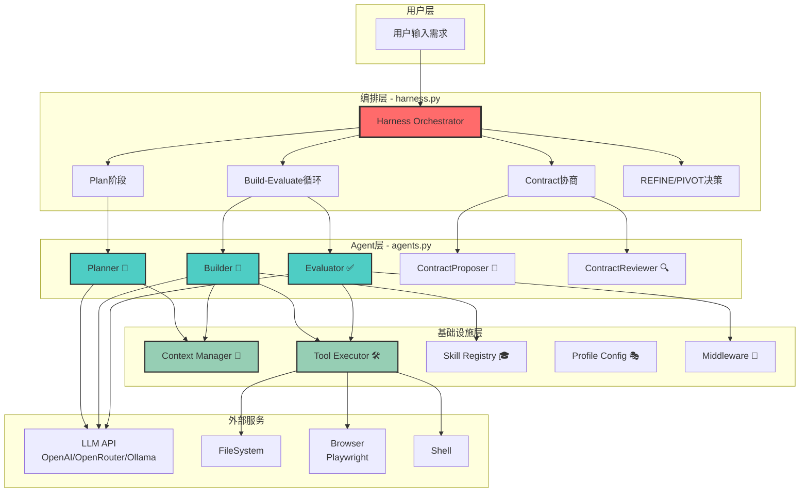

---

## 2. Agent执行流程图

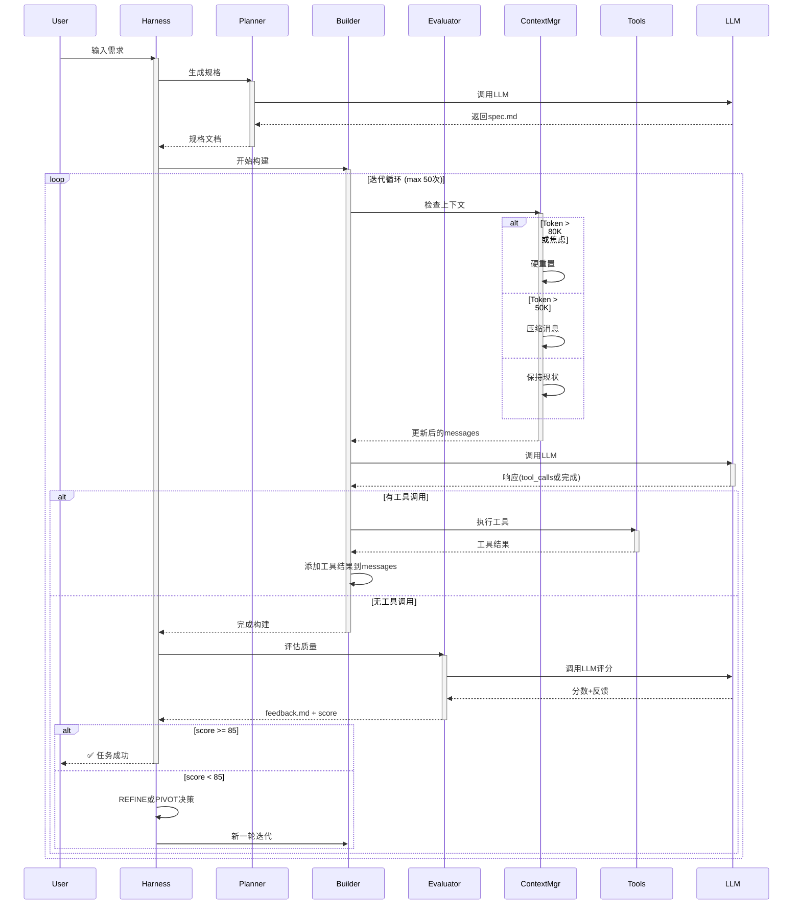

---

## 3. Context管理策略

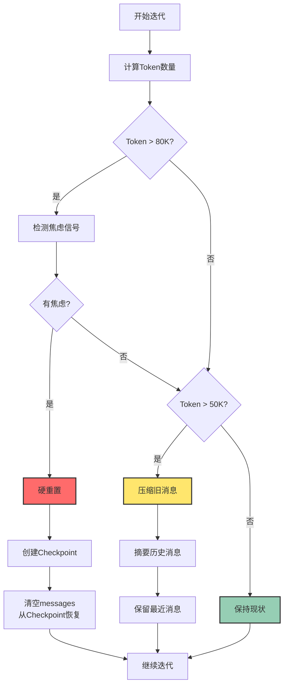

---

## 4. Profile系统架构

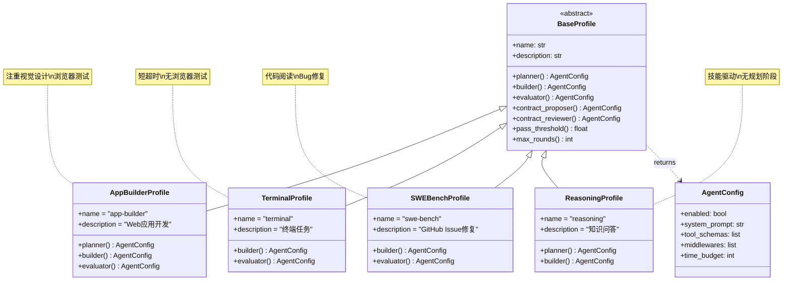

---

## 5. 技能加载流程

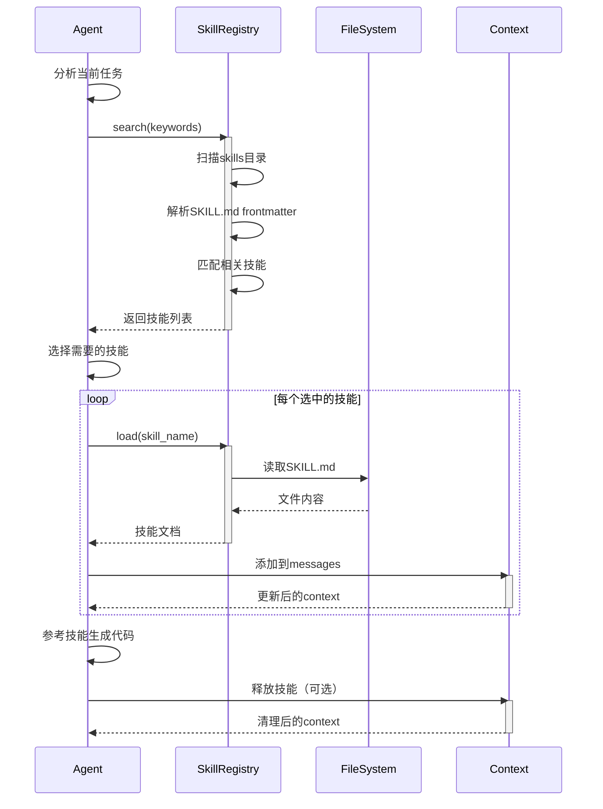

---

## 6. 工具执行流程

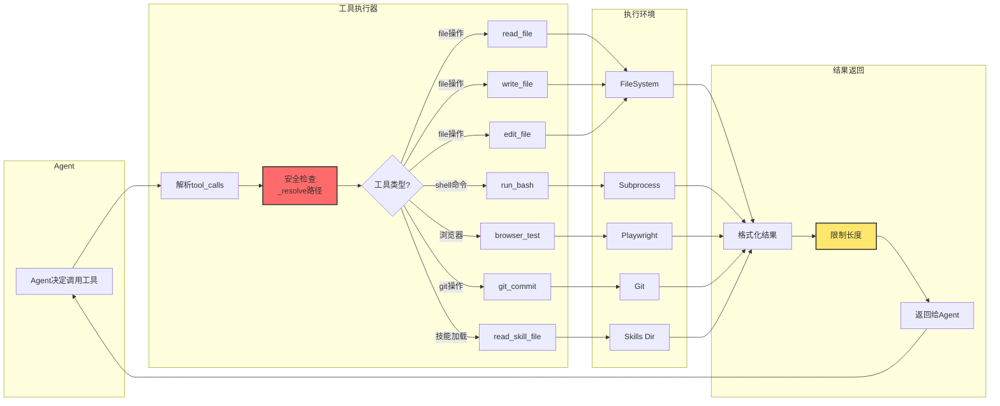

---

## 7. Middleware责任链

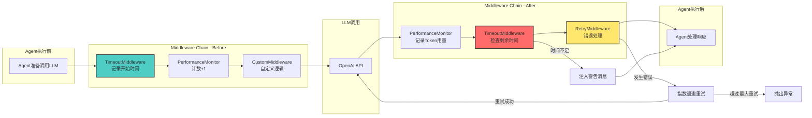

---

## 8. Contract协商流程

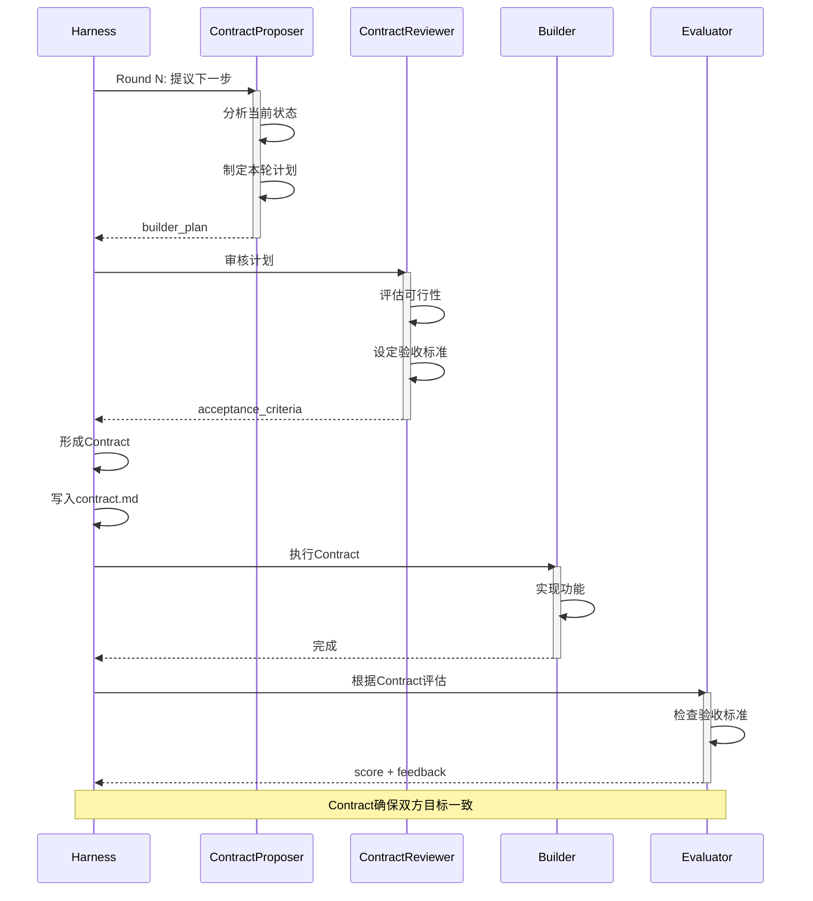

---

## 9. 数据流向图

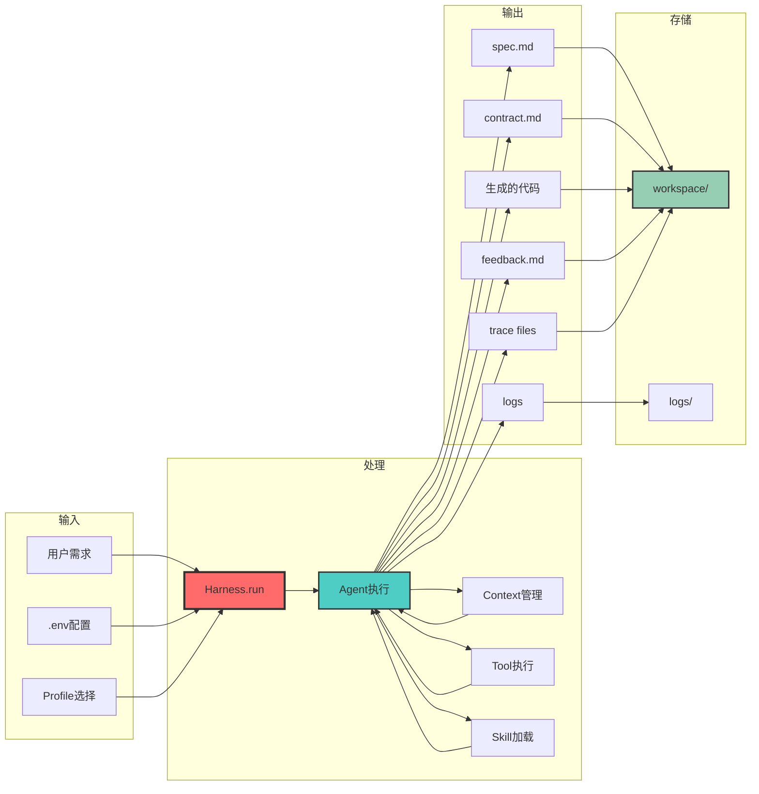

---

## 10. 依赖关系图

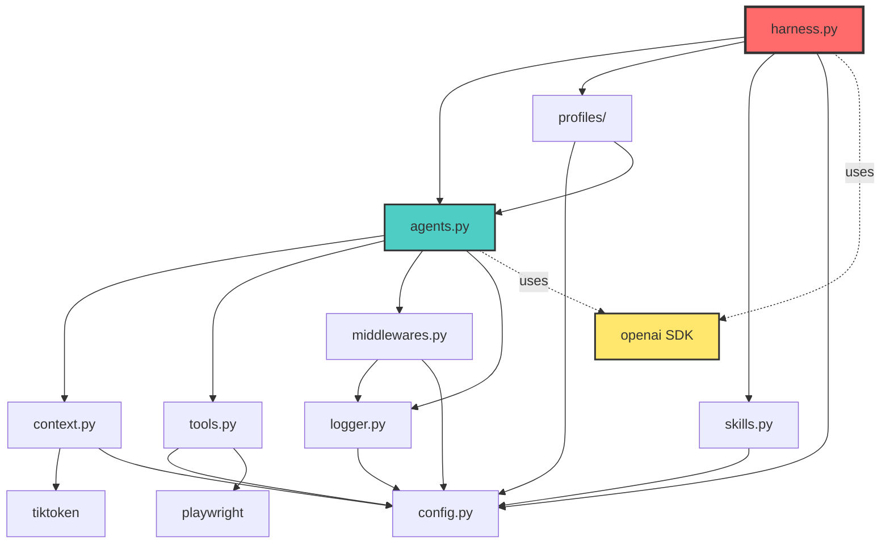

---

## 11. 文件结构树状图

```mermaid
graph TD
    Root[Harness_Engineering/]
    
    Core[核心引擎<br/>~2800行]
    Profiles[Profiles<br/>~300行]
    Skills[Skills<br/>37个]
    Support[支持模块<br/>~1200行]
    Runtime[运行时目录]
    
    Root --> Core
    Root --> Profiles
    Root --> Skills
    Root --> Support
    Root --> Runtime
    
    Core --> harness[harness.py<br/>521行]
    Core --> agents[agents.py<br/>427行]
    Core --> context[context.py<br/>310行]
    Core --> tools[tools.py<br/>1075行]
    Core --> prompts[prompts.py]
    
    Profiles --> base[base.py]
    Profiles --> app_builder[app_builder.py]
    Profiles --> terminal[terminal.py]
    Profiles --> swe_bench[swe_bench.py]
    Profiles --> reasoning[reasoning.py]
    
    Skills --> frontend[frontend-design]
    Skills --> password[password-recovery]
    Skills --> video[video-processing]
    Skills --> torch[torch-*]
    Skills --> others[...33 more]
    
    Support --> config[config.py]
    Support --> logger[logger.py]
    Support --> middlewares[middlewares.py<br/>~800行]
    Support --> skills_reg[skills.py]
    
    Runtime --> workspace[workspace/<br/>任务输出]
    Runtime --> logs[logs/<br/>日志文件]
    Runtime --> venv[.venv/<br/>虚拟环境]
    
    style Core fill:#ff6b6b,stroke:#333,stroke-width:2px
    style Profiles fill:#4ecdc4,stroke:#333,stroke-width:2px
    style Skills fill:#96ceb4,stroke:#333,stroke-width:2px
```

---

## 12. 性能监控图

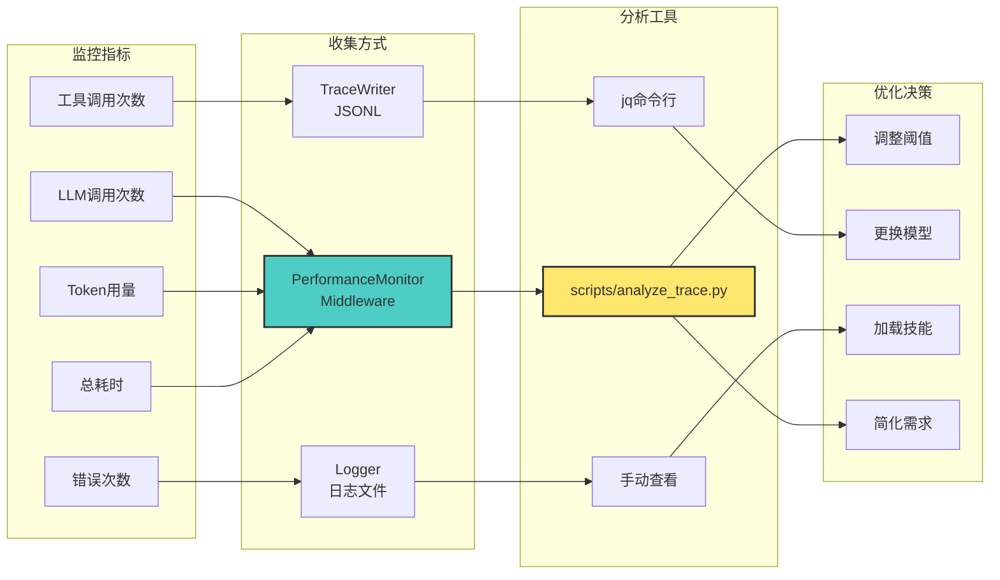

---

**📊 通过这些图表，你可以直观理解Harness的架构！**

*配合 [ARCHITECTURE.md](ARCHITECTURE.md) 和 [ARCHITECTURE_QUICK.md](ARCHITECTURE_QUICK.md) 使用效果更佳*

